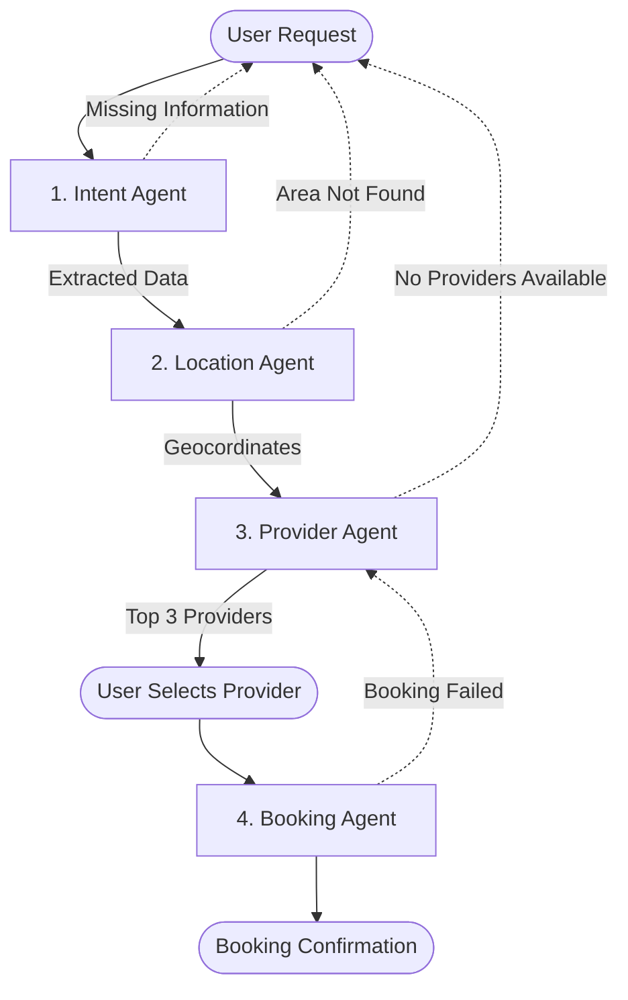

# Service Orchestrator: Multi-Agent System Architecture

This document outlines the architecture, roles, and interactions of the 4-agent multi-agent system designed for the **Service Orchestrator**. This system connects users with service providers (plumbers, electricians, AC technicians, etc.) in Pakistan's informal economy.

## 🔄 Orchestration Flow Diagram



---

## 📂 Shared Context Schema

As the user's request moves through the system, a central "Context" object is built and passed between agents. This ensures traceability and logging.

```json
{
  "request_id": "REQ-20260518-001",
  "user_phone": "+923001234567",
  "raw_message": "Mujhe kal subah G-13 mein AC technician chahiye",
  "intent_data": {
    "service_type": "ac_technician",
    "location_name": "G-13",
    "time": "tomorrow_morning",
    "urgency": "normal",
    "confidence": 0.95
  },
  "location_data": {
    "lat": 33.6844,
    "lng": 73.0479,
    "formatted_address": "G-13, Islamabad, Pakistan"
  },
  "provider_data": {
    "selected_provider_id": "PROV-889"
  },
  "booking_data": {
    "booking_id": "SRV-20260518-A7B3",
    "status": "confirmed"
  }
}
```

---

## 🤖 1. Intent Agent

**Role:** Understands user messages written in Urdu, Roman Urdu, or English. It uses Natural Language Processing to extract actionable data points from unstructured text.

| Property | Description |
| :--- | :--- |
| **Input** | `String` (User's natural language message) |
| **Output** | `JSON` with extracted fields + confidence score |
| **Key Extraction** | `service_type`, `location`, `time`, `urgency` |

**Error Handling:** 
* If `confidence` is below 0.60 or mandatory fields (e.g., `service_type` or `location`) are missing, it pauses the flow and asks the user for clarification (e.g., *"Aapko kis ilaqay mein service chahiye?"*).

**Example:**
* **Input:** `"Mujhe kal subah G-13 mein AC technician chahiye"`
* **Output:**
```json
{
  "service": "ac_technician",
  "location": "G-13",
  "time": "tomorrow_morning",
  "urgency": "normal",
  "confidence": 0.95
}
```

---

## 🌍 2. Location Agent

**Role:** Converts local area names or landmarks into standard GPS coordinates to enable distance-based provider matching.

| Property | Description |
| :--- | :--- |
| **Input** | `String` (Location name from Intent Agent) |
| **Output** | `JSON` with latitude, longitude, and formatted address |
| **Tools Used** | Google Maps Geocoding API |

**Error Handling:** 
* If the API returns `ZERO_RESULTS` (e.g., ambiguous name like "Main Road"), the agent falls back to asking the user to share their live location via WhatsApp/App or provide a famous landmark nearby.

**Example:**
* **Input:** `"G-13"`
* **Output:**
```json
{
  "lat": 33.6844,
  "lng": 73.0479,
  "formatted": "G-13, Islamabad, Pakistan"
}
```

---

## 👨‍🔧 3. Provider Agent

**Role:** Queries the database of registered service providers and ranks them based on an internal scoring algorithm.

| Property | Description |
| :--- | :--- |
| **Input** | `JSON` containing `service_type`, `user_coords` (lat/lng), `requested_time` |
| **Output** | Top 3 ranked providers with a score breakdown and reasoning |
| **Scoring Algorithm** | Distance (40%), Rating (40%), Availability (20%) |

**Scoring Formula:**
```text
Distance_Score = max(0, 40 - (distance_km × 2))
Rating_Score = (rating / 5.0) × 40
Availability_Score = 20 if available, 0 if not
Total = (Distance_Score × 0.40) + (Rating_Score × 0.40) + (Availability_Score × 0.20)
```

**Error Handling:** 
* If no providers match the criteria (e.g., late at night or outside coverage area), the agent returns a polite apology message offering scheduling for the next working day.

**Example:**
* **Input:** `{"service": "ac_technician", "lat": 33.6844, "lng": 73.0479, "time": "tomorrow_morning"}`
* **Output:**
```json
{
  "top_providers": [
    {
      "id": "PROV-889",
      "name": "Kamran AC Services",
      "distance_km": 2.1,
      "rating": 4.8,
      "score": 92,
      "reasoning": "Closest to G-13 with high rating and confirmed availability tomorrow."
    },
    {
      "id": "PROV-412",
      "name": "Irfan Technician",
      "distance_km": 4.5,
      "rating": 4.9,
      "score": 85,
      "reasoning": "Excellent rating, slightly further away (F-11)."
    }
  ]
}
```

---

## 📅 4. Booking Agent

**Role:** Finalizes the transaction by creating the booking record, generating a unique ID, and setting up automated confirmation and reminder notifications.

| Property | Description |
| :--- | :--- |
| **Input** | `JSON` containing selected provider ID, user details, confirmed time |
| **Output** | `JSON` with Booking ID, confirmation message, scheduled reminders |

**Error Handling:** 
* If the database transaction fails or the provider suddenly goes offline, the agent rolls back the booking, notifies the user, and re-triggers the Provider Agent to suggest the next best option.

**Example:**
* **Input:** `{"provider_id": "PROV-889", "user_id": "USR-123", "time": "2026-05-19T09:00:00"}`
* **Output:**
```json
{
  "booking_id": "SRV-20260518-A7B3",
  "status": "confirmed",
  "message": "Aapki booking Kamran AC Services ke sath confirm ho gayi hai. Technician kal subah 9 baje pohnch jayega.",
  "reminders_scheduled": true
}
```

---

## 🎬 Complete Workflow Example

**Scenario:** A user living in Johar Town, Lahore needs an urgent plumber.

1. **User Sends Message:** *"Bhai Johar Town block G mein pani ka pipe phat gaya hai, jaldi koi plumber bhejo."*
2. **Intent Agent:** Parses message. 
   * `service`: plumber
   * `location`: Johar Town block G
   * `urgency`: high (based on "phat gaya", "jaldi")
   * `time`: immediate
3. **Location Agent:** Resolves "Johar Town block G".
   * Returns: `{"lat": 31.4697, "lng": 74.2800, "formatted": "Block G, Johar Town, Lahore"}`
4. **Provider Agent:** Searches database. Weighs *Availability* and *Distance* heavily due to high urgency. 
   * Returns top match: "Aslam Plumbing Works" (1.5 km away, available now).
5. **User Selects:** Confirms Aslam.
6. **Booking Agent:** Creates booking `SRV-LHR-9921`.
   * Triggers SMS to User: *"Plumber Aslam (0300-XXXXXXX) 15 minute mein pohnch raha hai."*
   * Triggers SMS to Provider with user's exact map link.

---

## 📝 Agent Log Format

Every action taken by an agent is logged in a standardized JSON format to ensure traceability, debugging, and explainability.

```json
{
  "timestamp": "2026-05-18T22:48:00+05:00",
  "agent_name": "Provider_Agent",
  "input": "{\"service\": \"plumber\", \"lat\": 31.4697, \"lng\": 74.2800}",
  "reasoning": "Distance (1.5km) score 37. Rating (4.8) score 38.4. Availability score 20. Total = 95.4",
  "tool_used": "db_query",
  "tool_input": "SELECT * FROM providers WHERE service='plumber'",
  "tool_output": "3 rows returned",
  "decision": "Return top 3 providers sorted by score",
  "output": {
    "top_provider": "PROV-992",
    "score": 95.4
  }
}
```
